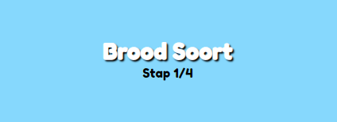
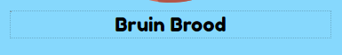

# Browser Technologie
Hieronderin kan je de resultaten vinden van het onderzoek van het vak Browser Technologie. Bij het onderzoek worden er verschillende features uitgezet om te bekijken wat er met de website gebeurt als deze features worden uitgezet of die uitstaan. Dit zorgt ervoor dat we real life scenario's kunnen recreeëren voor het geval deze features uistaan en wat we er mogelijk voor kunnen doen. 

## Table of Contents
* [Oba App](#oba-app)
* [Tosti Boodschappenlijst](#tosti-boodschappenlijst)
    * [Hoe gebruik ik de app?](#hoe-gebruik-ik-de-app?)
    * [App Wireflow](#app-wireflow)
    * [Feature Testing Tosti](#feature-testing-tosti)
    * [Feature Detection](#feature-detection)
        * [Grid Support Detection](#grid-support-detection)
        * [Javascript Detection](#javascript-detection)
        * [Javascript querySelector detection](#javascript-queryselector-detection)
    * [Feedback verbeteringen](#feedback-verbeteringen)
* [To Do List](#to-do-list)

## Oba App
<details>
<summary>Wat gebeurt er als er 1 van deze onderdelen niet doen op mijn oba website.</summary>

### 1. Images 
* Problemen
    * Afbeelding worden niet weergeven
    * Visueel minder aantrekkelijk
* Oplossing
    * Alt tekst toevoegen 
    `</img>`
### 2. Custom Fonts
Het probleem dat ik bij fonts had gevonden is dat fonts allemaal een andere groote en lengte hebben waardoor de lay out veranderde wanneer een font niet geladen word.
* Problemen
    * Fallbackfont is kleiner dan mijn custom font. Dus als mijn custom font wegvalt dan is de layout anders
* Oplossing
    * Fallback fonts: `font-family: 'Coming Soon', cursive; ` Als Coming Soon font niet gevonden is word de font family cursive gebruikt
### 3. Kleur
Bij het testen van de website met een kleurenblindheid plugin. Had ik als enige probleem dat de teskten af en toe lastig te lezen waren, omdat de font kleur en achtergrondkleur beide heel licht waren.
* Problemen
    * Bepaalde gedeeltes van de website worden onduidelijk
* Oplossing
    * Goeie contrast geven aan de background en de tekst. 
### 4. Geen Muis/Touchpad
Mijn website is vrijwel niet navigeerbaar zonder het gebruik muis/keyboard. De hover elementen worden niet getriggerd wanneer er overheen getabt word. 
* Problemen
    * Website word onnavigeerbaar
* Oplossing
    * `<a> </a>` tags gebruiken om ervoor te zorgen dat tab werkt op een website.
### 5. Breedband
* 
### 6. Javascript Uit
* Problemen
    * Sommige features doen het niet op de website. 
* Oplossing
    * een `<no-script></no-script>` tag: Dit zorgt ervoor dat de gebruiker een waarschuwing krijgt als javascript uit staat.
### 7. Cookie
Ik heb geen cookiest toegepast op mijn website waardoor het niet valt te testen.
### 8. Local Storage
Mijn website werkt prim zonder localstorage. Het enige wat niet meer snel word geladen zijn de backgrounds en kleur contrast van elke page, omdat dit de enige onderdelen zijn die in de localstorage worden opgeslagen
* Problemen
    * Background en kleur contrast duurt langer om te laden
* Oplossing
    * Niet/ of cookies gebruiken
</details>


## Tosti Boodschappenlijst
### Hoe gebruik ik de app?
```
Git clone deze repo

In command Line typ je: 

npm install

npm start

In browser:
localhost:5000

```

### App Wireflow


### Feature Testing Tosti
#### 1. Images
Bij de tosti app had ik precies hetzelfde probleem ondervonden als bij de  
* Problemen
    * Afbeelding worden niet weergeven
    * Visueel minder aantrekkelijk
* Oplossing
    * Alt tekst toevoegen 
    `</img>`
#### 2. Custom Fonts
Het probleem dat ik bij fonts had gevonden is dat fonts allemaal een andere groote en lengte hebben waardoor de lay out veranderde wanneer een font niet geladen word.
* Problemen
    * Fallbackfont is kleiner dan mijn custom font. Dus als mijn custom font wegvalt dan is de layout anders
* Oplossing
    * Fallback fonts: `font-family: 'Coming Soon', cursive; ` Als Coming Soon font niet gevonden is word de font family cursive gebruikt
#### 3. Kleur
Bij het testen van de website met een kleurenblindheid plugin. Had ik als enige probleem dat de teskten af en toe lastig te lezen waren, omdat de font kleur en achtergrondkleur beide heel licht waren.
* Problemen
    * Bepaalde gedeeltes van de website worden onduidelijk
* Oplossing
    * Goeie contrast geven aan de background en de tekst. 
#### 4. Geen Muis/Touchpad
Mijn website is vrijwel niet navigeerbaar zonder het gebruik muis/keyboard. De hover elementen worden niet getriggerd wanneer er overheen getabt word. 
* Problemen
    * Website word onnavigeerbaar
* Oplossing
    * `<a> </a>` tags gebruiken om ervoor te zorgen dat tab werkt op een website.
#### 5. Breedband
* 
#### 6. Javascript Uit
* Problemen
    * Sommige features doen het niet op de website. 
* Oplossing
    * een `<no-script></no-script>` tag: Dit zorgt ervoor dat de gebruiker een waarschuwing krijgt als javascript uit staat.
#### 7. Cookie
Ik heb geen cookiest toegepast op mijn website waardoor het niet valt te testen.
#### 8. Local Storage
Mijn website werkt prim zonder localstorage. Het enige wat niet meer snel word geladen zijn de backgrounds en kleur contrast van elke page, omdat dit de enige onderdelen zijn die in de localstorage worden opgeslagen
* Problemen
    * Background en kleur contrast duurt langer om te laden
* Oplossing
    * Niet/ of cookies gebruiken

### Feature detection 
#### Grid support detection
Eerst word er gekeken of de browser `display:grid` support als dat niet het geval is word er `position: absolute` gebruikt
```css
@supports (display: grid){
    .soort,
    .beleg{
        display: grid;
        grid-template-columns: 1fr;
    }
    /* Childs */
    #keuzes .soort > .optie,
    .beleg-categorie-opties{
        grid-row-start: 1;
        grid-column-start: 1;
    }
}
@supports not (display: grid){
    .soort,
    .beleg{
        position: relative;
    }
    /* Childs */
    #keuzes .soort > .optie,
    .beleg-categorie-opties{
        position: absolute;
        top: 0;
        left: 0;
    }
}
```
#### Javascript detection
Gebruiker word naar een versie van de website geleid aan de hand van of javascript aanwezig is in de browser
```js
if(document.querySelector){
    if(document.querySelector('form')){
        document.querySelector('form').action = '/javascriptYES'
    }
}else{
    // Oldest function
    const form = document.getElementsByTagName('form')
    // Er is toch maar 1 form beschikbaar hier
    form[0].action = '/javascriptYES'
}
``` 
#### Javascript querySelector detection
Als querySelector niet aanwezig is dan word de oudste manier gebruikt namelijk getElementsByTagName
```js
document.getElementsByTagName('form').action = '/javascriptYES'
```

### Feedback Verbeteringen
#### Contrast net fout
Contrast van de witte tekst op lichtblauwe achtergrond was slecht waardoor het niet heel leesbaar was. Ik heb daarvoor een text shadow toegepast zodat de tekst wast meer naar voren springt en dusdanig leesbaarder is geworden.

#### Labels Outline
Geen outline rondom de labels, dus als een gebruiker met tab door de website wilt navigeren is er geen duidelijke indicatie waar hij/zij is op dat moment. Ik heb dus een outline toegepast in de css.
```css
input:focus + label{
    outline: rgba(0,0,0,.2) dotted 1px;
}
```


#### Geen alt tekst nodig
Alt tekst was niet meer nodig bij de afbeeldingen omdat het beschrijving van de afbeelding onder staat. Daarom is de alt tekst overbodig.
```html

<p>Ham</p>
```

### To Do List
- [x] Contrast net fout
    - Kleuren veranderne van de tekst omdat de witte tekst met licht blauwe achtergrond niet goed werkt. 
- [x] Labels Outline
- [x] Geen alt tekst nodig
- [ ] Noteren wat de verbeteringen waren   